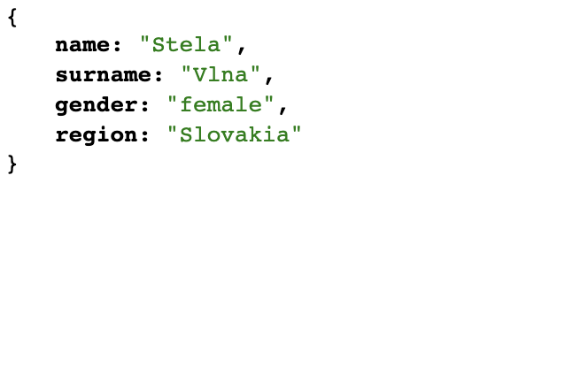

This project was bootstrapped with [Create React App](https://github.com/facebook/create-react-app).

## Title: Wedding App

## Description 

Essentially this will be a Zola clone. The homepage will be the guestlist RSVP page with the ability to add more guests via an input. The page will have counters representing who have confirmed, not confirmed and total guests. 

There will be 3 options for the guests: 

- confirmed (box checked)
- unconfirmed (box not checked)
- not coming (box deleted)

There will also be a photos tab on the navigation bar. Will use <b>React Router</b> to Link to this page. 

## API

Will be using a Random Person API ('https://uinames.com/api/')

This will be used to already have a number of 'guests' already on the page. Will be taking full name data of random people

## Components

So far, these are the components I feel are necessary for this app.

- header.js
  - photos.js
  - registry.js
- totalGuests.js (will have class component)
- confirmedGuests.js
- unconfirmedGuests.js
- addGuest.js
- randomGuests.js (this will be calling the API)

## MVP 

MVP for this app:

- functionality of adding to the potential guest list
- ability to have a checkbox that adds potential guest to confirmed guest
- have a counter that displays totalGuests
- have another page that displays images of the couple and maybe a 'how we met' section
- making the app make the user feel happiness (from the CSS) 

## Stretch Goals

Make a registry page. Was thinking about using a Shopping API to render images of registry-appropriate items. Make a local storage of images for the photos/registry.
